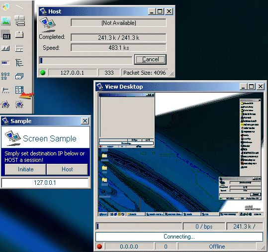



## ActiveX Desk View Control

### Description

This control allows you to view another PC desktop. Features packet sizing, collision handling, and screen sizing, allowing smaller file sizes and faster transmissions.
Sample project included in zip.

This is an update to previous code I posted around last year. This update allows you to drop the control onto a form, with the added feature of virtually no coding...just set the Port and IP values and connect!

Don't forget to vote =)
 
### More Info
 

             |
---                |---
**Submitted On**   |2001-10-11 10:37:26
**By**             |[Michael A\. Schmidt](https://github.com/Planet-Source-Code/PSCIndex/blob/master/ByAuthor/michael-a-schmidt.md)
**Level**          |Advanced
**User Rating**    |5.0 (50 globes from 10 users)
**Compatibility**  |VB 6\.0
**Category**       |[OLE/ COM/ DCOM/ Active\-X](https://github.com/Planet-Source-Code/PSCIndex/blob/master/ByCategory/ole-com-dcom-active-x__1-29.md)
**World**          |[Visual Basic](https://github.com/Planet-Source-Code/PSCIndex/blob/master/ByWorld/visual-basic.md)
**Archive File**   |[ActiveX De2855210112001\.zip](https://github.com/Planet-Source-Code/michael-a-schmidt-activex-desk-view-control__1-27994/archive/master.zip)

